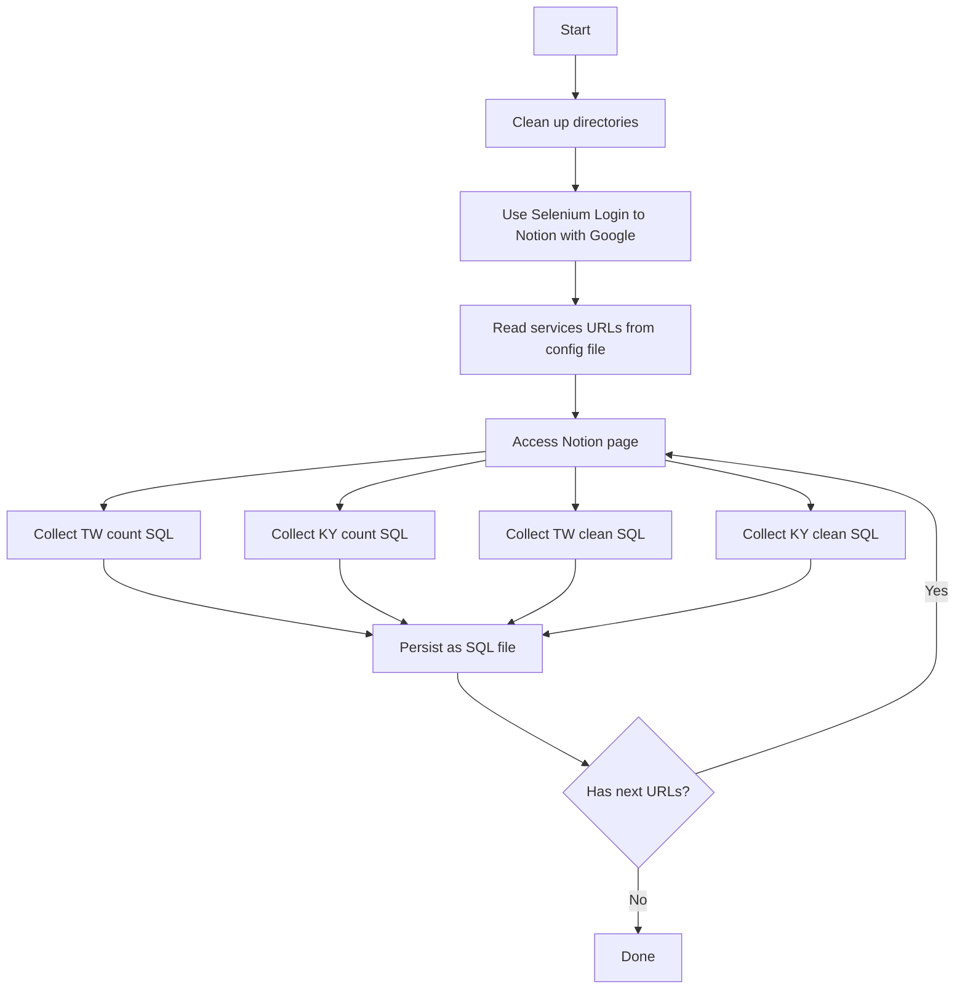
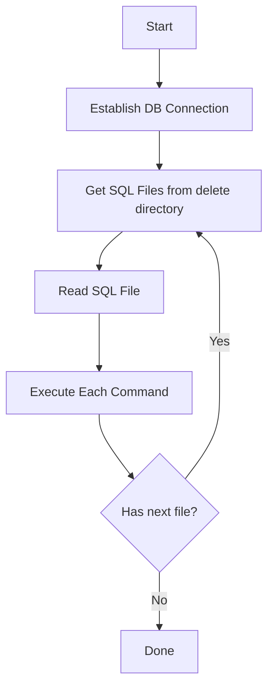

# Script Execution Guide

The script `/script/run_count.py` will execute the following steps:

## 1. `scraper_stable.py`
   - Scrapes links from `notion_links.txt`.
   - Extracts SQL statements between the following markers:
     - `#count_tw_start` & `#count_tw_end`
     - `#count_ky_start` & `#count_ky_end`
     - `#clean_tw_start` & `#clean_tw_end`
     - `#clean_ky_start` & `#clean_ky_end`
   - Saves the extracted SQL files under the `/count` and `/delete` folders.

## 2. `estimate_count.py`
   - Generates CSV files that estimate SQL execution time for the SQL files in the `/count` folder.

## 3. `execute_sql.py`
   - This will execute all the SQL files under `/delete` folder.
   
## Flow Chart
### run_count.py

### execute.py

