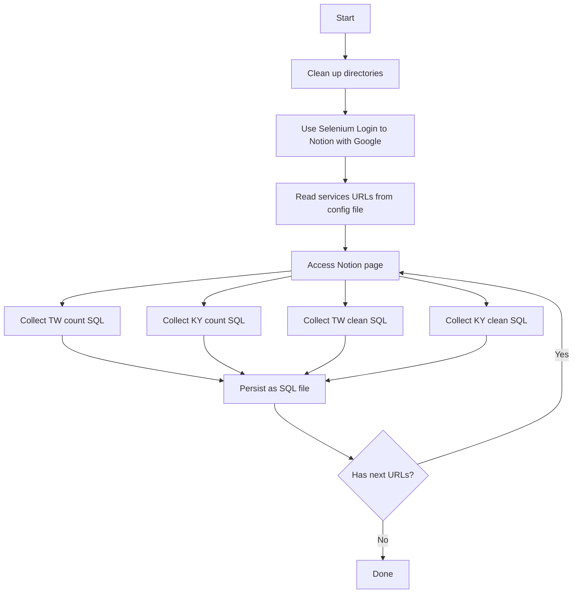
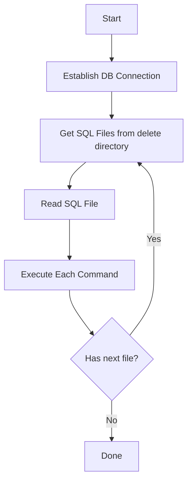

# Timeline
## 3/25
  1. Execute `generate.py` to generate
     - `.sql files` that contain delete SQLs
     - `csv reports` of SQL estimated execution time
  2. SRE pass `.sql files` and `csv reports` to BE. 
  3. BE will break down and provide new delete `.sql files` for SRE.

## 5/6 Release
  1. Run `execute_sql.py` to execute all delete `.SQL files` that provide by BE.

<br>
<br>

---
# Script Execution Guide

This repository contains scripts for scraping SQL queries from Notion and executing them to estimate and clean up data.

## Scripts Overview

## `generate.py`
- This will run `scraper_stable.py` and  `estimate_count.py`

## `scraper_stable.py`
- Scrapes SQL queries from Notion pages listed in `notion_links.txt`
- Extracts SQL statements between markers:
  - `#count_tw_start` & `#count_tw_end`
  - `#count_ky_start` & `#count_ky_end`
  - `#clean_tw_start` & `#clean_tw_end`
  - `#clean_ky_start` & `#clean_ky_end`
- Saves extracted SQL files to:
  - `/count/count_tw/` and `/count/count_ky/` for count queries
  - `/delete/delete_tw/` and `/delete/delete_ky/` for cleanup queries

## `estimate_count.py`
  - Generates CSV files that estimate SQL execution time for the SQL files in the `/count` folder.

## `execute_sql.py`
  - This will execute all the SQL files under `/delete` folder.

## Setup Instructions

### Prerequisites
1. Python 3.x

### Installation

1. Install Python dependencies:
```
pip install -r requirements.txt
```

2. Configure properties files in `/properties` directory:
   - `credentials.properties`: Google login credentials for Notion
   - `config.properties`: Database and directory configurations
   - `notion_links.txt`: URLs of Notion pages to scrape

### Directory Structure
```
count_result/
├── script/
│   ├── scraper_stable.py
│   ├── estimate_count.py
│   └── execute_sql.py
├── properties/
│   ├── credentials.properties
│   ├── config.properties
│   └── notion_links.txt
├── count/
│   ├── count_tw/
│   └── count_ky/
├── delete/
│   ├── delete_tw/
│   └── delete_ky/
└── estimate/
    ├── estimate_tw/
    └── estimate_ky/
```


## Flow Chart
### run_count.py


### execute.py

