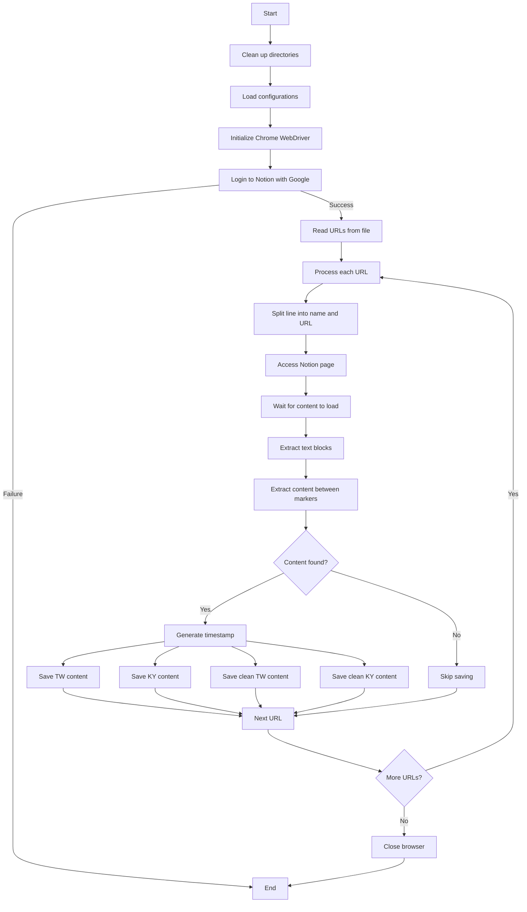

```mermaid
flowchart TD
    A[Start] --> B[Clean up directories]
    B --> C[Load configurations]
    C --> D[Initialize Chrome WebDriver]
    D --> E[Login to Notion with Google]
    
    E -->|Success| F[Read URLs from file]
    E -->|Failure| G[End]
    
    F --> H[Process each URL]
    H --> I[Split line into name and URL]
    I --> J[Access Notion page]
    J --> K[Wait for content to load]
    K --> L[Extract text blocks]
    L --> M[Extract content between markers]
    
    M --> N{Content found?}
    N -->|Yes| O[Generate timestamp]
    N -->|No| P[Skip saving]
    
    O --> Q[Save TW content]
    O --> R[Save KY content]
    O --> S[Save clean TW content]
    O --> T[Save clean KY content]
    
    Q --> U[Next URL]
    R --> U
    S --> U
    T --> U
    P --> U
    
    U --> V{More URLs?}
    V -->|Yes| H
    V -->|No| W[Close browser]
    W --> G
``` 